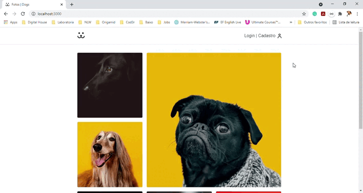
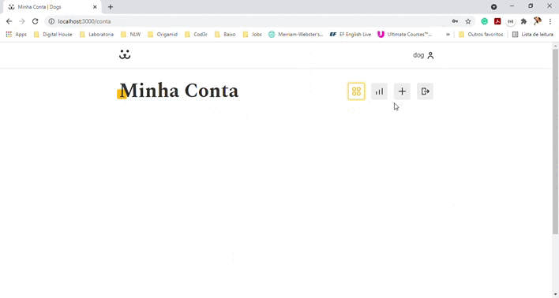
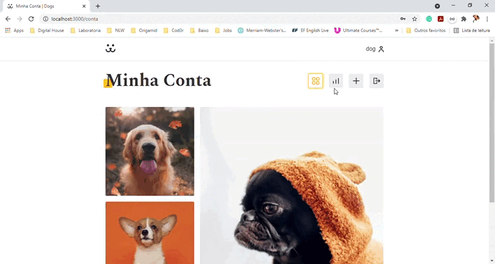
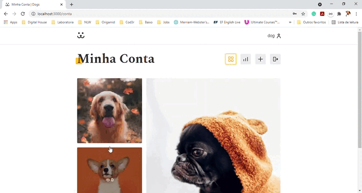

<h1 align="center">
   | Dogs
</h1>

## Índice

- [1. Introdução](#1-introdução)
- [2. Dogs](#2-dogs)
- [3. Estrutura e funcionalidades](#3-estrutura-e-funcionalidades)
- [4. Ferramentas Utilizadas](#4-ferramentas-utilizadas)
- [5. Considerações Finais](#5-considerações-finais)
 ---
 

## 1. Introdução
Aplicação Web desenvolvida durante o curso de React completo da <strong>[Origamid](https://www.origamid.com/)</strong>.

---
 

## 2. Dogs

O projeto consiste em desenvolver uma rede social para cachorros, colocando em prática tudo que foi aprendido durante o curso de <strong>[React Completo](https://www.origamid.com/curso/react-completo/)</strong>.

  

 

A API utilizada nesse projeto é a API desenvolvida pelo curso <strong>[WordPress REST API Dogs](https://www.origamid.com/curso/wordpress-rest-api-dogs/)</strong>.

 

Como desenvolvimento de uma rede social, foi criada uma página de Login:

  

 

Onde após logado o usuário é redirecionado para a página <strong>Minha Conta</strong>, onde consta todas as suas postagens.
Uma vez logado o usuário tem acesso ao menu de navegação que pode levá-lo a postagem de novas fotos:

  

 

Possui também acesso a área de estatísticas, onde através da biblioteca <strong>`Victory`</strong>, foi possível desenvolver gráficos para visualizar os acessos da página e de cada foto:

  

 

O usuário logado, poderá também comentar nas postagens dos demais usuários:

  

 

Além da página de login foi desenvolvida a página de cadastro, ondem o usuário pode estar se cadastrando somente com um nome de usuário, e-mail e senha.
Esses campos possuem validação em tempo real para campo vazio, e-mail válido e senha forte.

  

 

E para uma melhor experiência de usuário, foi desenvolvido uma página onde caso ele esqueça a senha que foi cadastrada no site, ele possa fazer a recuperação dela. A senha pode ser recuperada através do e-mail ou do nome do usuário.

  
  

 

Essa é uma aplicação bem completa, foi desenvolvido Hooks específicos para determinadas chamadas, além de Rotas privadas, animações com SVG, `useContext`, e tudo isso é explicado no curso.

---
 

## 4. Ferramentas Utilizadas

As seguintes ferramentas foram usadas na construção do projeto:

- [x] ReactJS
- [x] React Router Dom
- [x] JavaScript
- [x] CSS
- [x] Victory

---
 

## 5. Considerações Finais

Gostou da rede social, e deseja interagir com ela?
A Origamid fez o deploy do projeto para quem quiser interagir com a aplicação. Acesse:

<table align="center">
  <tr>
    <td align="center">
      
    </td>
    <td align="justify">
      Login: <strong>dog</strong>
       
      Senha: <strong>dog</strong>
    </td>
  </tr>
</table>

<strong>Lembrando:</strong> a cada 10 minutos é restaurado os dados originais da aplicação, apagando postagens, comentários, etc.

Obrigada ao professor <strong>André Rafael</strong> pelo maravilhoso curso, e pela didática.

---

  <a href="https://github.com/kauanaagostini"> <b>Kauana Maria Agostini</b></a>

